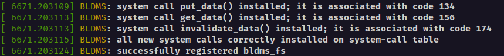
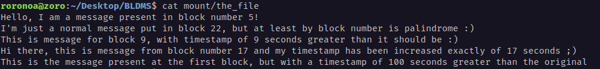

[](https://www.gnu.org/licenses/gpl-3.0)

# BLDMS: Block-Level Data Management Service
*Author: Andrea Pepe (ID: 0315903)*

## Table of contents
1. [Introduction](#introduction)
2. [Project's design and structure](#projects-design-and-structure)
    - [Device block's structure](#device-blocks-structure)
    - [Data structures used by the driver](#data-structures-used-by-the-driver)
3. [The driver](#the-driver)
    - [System calls](#system-calls)
        - [put_data()](#put_datachar-source-size_t-size)
        - [get_data()](#get_dataint-offset-char-destination-size_t-size)
        - [invalidate_data()](#invalidate_dataint-offset)
    - [File operations](#file-operations)
        - [lookup()](#lookup)
        - [read()](#read)
        - [open()](#open)
        - [release()](#release)
        - [llseek()](#llseek)
4. [Installation](#installation)
    - [USCTM module](#usctm-module)
    - [Compiling the BLDMS module](#compiling-the-bldms-module)
    - [Formatting and installation](#formatting-and-installation)
    - [Unmount and uninstall](#unmount-and-uninstall)

5. [Usage](#usage)
6. [Notes](#notes)


***

## Introduction
The **Block-Level Data Management Service** is a project developed within the course of Advanced Operating Systems and System Security of the MS Degree in Computer Engineering of the Univeristy of Rome, Tor Vergata, during the 2022/23 academic year.

The project consinst in the realization of a **Linux device driver** implementing block-level maintenance of user messages. The driver is essentially based on system-calls, partially supported by the Virtual File System (VFS) and partially not.
For further details on the project's specifications, please refer to the [REQUIREMENTS.md](./REQUIREMENTS.md) file.

***

## Project's design and structure
The block device driver is implemented within a Linux Kernel **module** that, when installed, registers in the kernel a new type of file-system: it is, indeed, a **single-file file-system**, able to host only one single file. Such file will be used as the block device for which the driver is implemented.

The file-system image, in addition to the file mentioned above, contains other 2 blocks: the file-system superblock and the inode of the single file. Its structure will look as follows:

```
+---------------+---------------+---------------+---------------+---------------+
|               |               |               |               |               |
|  Superblock   |   File Inode  |   Datablock   |               |   Datablock   |
|      0        |       1       |       2       |      ...      |      N-1      |
|               |               |               |               |               |
|               |               |               |               |               |
+---------------+---------------+---------------+---------------+---------------+
```

Moreover, the module will register the 3 system-calls of the device driver into the system-call table, relying on the **USCTM module** for the discovery of both **system-call table** and **sys_ni_sys_call** location. The source code of such module is available in the [usctm](./usctm/) directory of this repository.

### Device block's structure
A single block of the device has size 4KB, but it is structured in such a way that the first part of the block is filled with metadata keeping informations about the block; in particular, there are 3 fields that make up the metadata:
- *nsec* : timestamp specified in nanoseconds from the 1st January 1970, representing the time at which the message contained in the block has been written;
- *is_valid* : 1 bit field that signals if the block is logically valid or not, determining wether or not the content of the block can be read;
- *valid_bytes* : 15 bit field, used to store the length of the message contained in the block.

A one to one mapping between the representation of metadata on the device blocks and the in-memory representation is performed by the struct defined in the [device.h](./include/device.h) file:
```c
typedef struct __attribute__((packed)) bldms_block{
    ktime_t nsec;                           // 64 bits
    unsigned char is_valid : 1;             // 1 bit
    uint16_t valid_bytes : 15;              // 15 bits 
} bldms_block;
```

Therefore, metadata occupies **10 bytes** and, since device blocks have size of 4 KB, the maximum payload size for a message is **4086 bytes**.

### Data structures used by the driver
When a mount operation for the device is invoked, there are 2 main data structures that the kernel will setup and keep in memory, in order to correctly perform the requested operations on the device, through the driver:
- **array of blocks' metadata**
- **RCU list of valid blocks**

First of all, when the mount operation is invoked, a check on the device size will be performed: the number of total blocks of the device is computed and, if it is bigger than a compile-time chosen parameter **NBLOCKS**, the mounting of the device will fail. Otherwise, the kernel will setup the 2 described data structures. 

For what concerns the first one, it is an array with an entry for each block present on the device, keeping the representation of the single blocks' metadata (i.e. each entry is represented by the struct illustrated above). The kernel will read, in index order, the metadata of all the blocks of the device, with a particular attention to the ones that are valid. Indeed, for each valid blocks, an appropriate element is added to the RCU list structure.

The purposes of the two data structures are different: the **array** is only used by write operations on the device, in particular for searching the next available block when a new message should be added to the device. Instead, the **RCU list** only keeps metadata of valid blocks and is accessed by both write and read operations. Moreover, the list is always kept sorted by increasing timestamp: this property permits to easily satisfy the project requirement of delivering messages in the order they have been written, upon read() invokations.

The RCU list is implemented making use of the **kernel level RCU APIs**, exported by the *list.h* and *rculist.h* header files. Write operations on the list are controlled by a **spinlock**: this guarantees that only **one single writer at a time** can modify the list. Clearly, readers can access the list concurrently, without the need of using the spinlock. A reader signals its presence through the **rcu_read_lock()** API and announces to have finished reading from the list through the **rcu_read_unlock()** API. A writer that adds a new element in the list, makes use of the **list_add_rcu()** API, while a writer that removes an element from the list invokes the **list_del_rcu()** API, but needs to wait for a **grace period** to free the removed element, in order to ensure that readers potentially holding a reference to such element have signaled the end of their RCU read-side critical sections. This is done by invoking the **synchronize_rcu()** API.

It should be underlined that elements kept in the RCU list do not contain the message payload stored in the block, but only keep some of the block's metadata and an additional reference to the index of the block. Indeed, read operation will directly access the device to retireve the payload. This way, you avoid keeping large amount of data in memory. The single element of the RCU list is defined by the following structure (in the [rcu.h](./include/rcu.h) file):
```c
typedef struct _rcu_elem {
    uint32_t ndx;
    ktime_t nsec;
    size_t valid_bytes;
    struct list_head node;
} rcu_elem;
```

An additional **note about the spinlock**: since it is adopted for regulating concurrent access by writers, its use is extended not only to the RCU list, but also to the metadata array, so as to prevent different writers from selecting the same free block for writing a new message.

The use of an RCU list introduces several advantages:
- it potentially reduces the algorithmic cost of searching for a valid block, since it only keeps a subset of all the device blocks;
- it significantly improves performances and scalability in read-intensive scenarios, with respect to a pure spinlocks-regulated coordination scheme;
- it allows readers and writers to access the list concurrently, providing correctness of operations thanks to the grace period waiting.

An image representing the described data structures is given below:


***

## The driver
As mentioned before and as explained with several details in the requirements of the project, the driver is partially made up of system calls and partially made up of VFS file-operations.

### System calls
They are defined in the [syscalls.c](./syscalls.c) file.
All the system calls, as well as the file operations of the driver, have to return the ENODEV error when the device is not mounted. For this purpose, a global variable (_bldms_mounted_) is declared in the [bldms.c](./bldms.c) file, and is set to 1 when the device is actually mounted. In the same way, a global variable holds a reference to the file-system superblock, used by the system calls to read blocks from the device through the **sb_bread()** API.

#### ___put_data(char *source, size_t size)___
New messages are written on the device following a circular buffer scheme. Such behaviour avoids over-using some of the blocks of the device (e.g. selecting the first free block starting from the first block of the device). Instead, each successful call to the _put_data()_ system call updates a global variable, called _last_written_block_, which keeps the index of the block that has been selected for the last insertion of a new message. The research of the free block starts from the index that immediately follows the one stored in _last_written_block_ and scans the **metadata array** until a free block is found or all the blocks have been detected as already occupied. If no free blocks are found, the system call returns with the ENOMEM error.

This type of block management has been preferred in anticipation of the use of a physical device, allowing to have a homogeneous use of the physical memory blocks and cells, so as to have an impact that reduces the wear of the components as much as possible.

The research of the free block (**all invalid blocks are considered "free"**) has a linear cost with respect to the number of blocks of the device. 

The existence of the metadata array isn't strictly necessary and it surely occupies a potentially non-minimal amount of memory, but it allows to keep the described algorithmic cost at a linear level; otherwise, such research should have been carried out on the RCU-list of valid blocks, which is not sorted by block index. So, the circular buffer management implemented for block writing would have been much more complex and expensive, also considering that the research is performed in a critical section.

Speaking of critical section, important care was taken during the implementation to make it as short as possible, also avoid including unnecessary blocking calls: all the potentially necessary dynamic allocations are made in advance before the critical section, as well as the call to the **ktime_get_real()** API used to assign a timestamp to the new message. In particular, this last aspect implies that inserting the new element at the end of the RCU list does not guarantee to keep the list sorted by timestamp, since it is possible that a concurrent thread calls **ktime_get_real()** after the current thread, but acquires the writing spinlock before the current thread, thus carrying out the insertion in the list first. For this reason, insertions into the list are done in an sorted manner: this carries a potential O(N) cost, but, scanning the list from the end, the cost should be much lower on average, since it is truly rare the case in which the described scenario happens and there is also the need to iterate on all elements of the list.

Making a simplified summary of what the system call does:
1. Allocate the necessary structures and initialize metadata for the new message; 
2. Acquire the writing spinlock and enter the critical section;
3. Scan the metadata array to found a free block; 
4. Load the block in memory using the **sb_bread()** API;
5. Modify the content of the in memory block, both data and metadata, and mark the buffer as dirty, by invoking **mark_buffer_dirty()**;
6. Insert a new node in the RCU-list with a sorted insertion;
7. Update the corresponding entry of the block into the metadata array and also update the value of the _last_written_block_ variable ;
8. Release the writing spinlock and exit from the critical section;
9. If the module has been compiled with the **SYNCHRONOUS_PUT_DATA** directive set, synchronously flush the content of the block on the device, by invoking the **sync_dirty_buffer()** API; note that this is done outside of the critical section, since it requires a blocking API call.
10. Free the old structures that have been replaced by the new ones.


#### ___get_data(int offset, char *destination, size_t size)___
The *get_data()* system call scans the RCU list in order to check if the block with the requested *offset* (here "offset" is intended as the index of the block on the device) actually keeps a valid message. If an element in the RCU list is found, the index of the block is used to read the message directly from the device, using the **sb_bread()** API. The content of the message, up to *size* bytes, is delivered in the user space buffer, by invoking **copy_to_user()**. Iterating only on the RCU list instead that on the entire array of metadata, can result in better performances, expecially in cases where the device keeps a small number of valid messages. 

It should be noticed that accessing the array of metadata, known the index of the block, would have a constant O(1) cost, but, to be able to guarantee correctness of operations, the reader should acquire the same spinlock used by the writers. By doing so, all the advantages coming from concurrent accesses by readers and writers to the device, introduced by the RCU list, would be nullified.

A summary of the operations performed by the *get_data()* is the following:
1. Enter the RCU read-side critical section by invoking **rcu_read_lock()**;
2. Scan the RCU list, until an element with index equal to the value of the *offset* argument is found or the list is finished;
3. If no element is found in the list, return the ENODATA error; otherwise, read the content of the target block from the device through **sb_bread()**;
4. Copy up to *size* bytes of the message in the user space buffer, using **copy_to_user()**;
5. Signal the end of the RCU read-side critical section, by invoking **rcu_read_unlock()**;
6. Return the number of bytes actually copied into the user space buffer.

#### ___invalidate_data(int offset)___
The *invalidate_data()* system call tries to logically invalidate the block at index *offset* of the device. In order to do that, a research of the target block is performed in the RCU list: if the block with such index is present, it can be invalidated, otherwise, the system call just returns with the ENODATA error. Since this system call can result in the removal of an element from the RCU list, the **acquisition of the writing spinlock** is necessary and, consequently, the execution of some operations in a critical section.

It's very important that the free of the memory area containing the element removed from the RCU list is performed only after a **grace period**, in order to allow readers holding a reference to the element to correctly use it, without running into errors.

It should be pointed out that the invalidation does not affect the payload of the message, but only the metadata (in particular the _is_valid_ field/bit) of the block in which it is stored. The message becomes logically invalid, but its content is untouched and remains on the device until the addition of some other messages overwrites it.

The operations performed by the system call are the following:
1. Acquire the writing spinlock and enter the critical section;
2. Iterate over the RCU list in order to find the target block and get a reference to it, if any;
3. If no block with the target index is found in the list, return the ENODATA error; otherwise, remove the element from the RCU list using the **list_del_rcu()** API;
4. Update the corresponding entry of the metadata array, setting the *is_valid* field to *BLK_INVALID*; also load in memory the block and modify its metadata part, signaling that it should be rewritten on disk by invoking **mark_buffer_dirty()**;
5. Release the spinlock, exiting from the critical section;
6. Wait for the **grace period**, by invoking the **synchronize_rcu()** API;
7. Once the grace period ended, if the module has been compiled with the **SYNCHRONIZE_PUT_DATA** directive set, flush the content of the in-memory buffer on the device, by calling **sync_dirty_buffer()**;
8. Finally release the memory area in which the RCU element was contained, by invoking **kfree()** and return 0 if the system call succedeed.  


### File operations
Like system calls, also file operations return the ENODEV error if the device is not mounted. They are defined in the [file_ops.c](./file_ops.c) source file.

#### ___lookup()___
It simply performs the lookup for the single file of the file system, setting up the inode and the dentry.

#### ___read()___
The *read* operation has to deliver the valid messages stored on the device according to the order of the delivery of data to the device. In order to perform such operation, additional informations are saved in the session, using the **private_data** field of the **struct file** structure: in particular, such field points to a value representing the timestamp of the expected message to be read on the following call to the *read* operation. This is useful, since each invokation of the _read_ at most returns the content of a single block. This means that the next block to be read can be invalidated between two consecutive _read_ invokations. 

Saving the timestamp of the next expected message, allows to know if such message has been invalidated or not: since the RCU list is timestamp-wise sorted, when scanning it, if the research arrives to consider a block with timestamp larger than the expected one, it means that the expected block has been invalidated. In such case, the block with the minimum timestamp value bigger than the expected one is delivered to the user, instead.

So, the operations performed by the _read_ are the followings:
1. Compute the index of the block to be read, based on the specified offset;
2. Enter the RCU read-side critical section by invoking the **rcu_read_lock()** API;
3. Iterate over the RCU list to find the block with the index computed before or the first block with timestamp larger than the one specified in the session;
4. If no block is found, set the offset to the end of the file, because it means that all the valid messages have been read;
5. Otherwise, read the target block from the device by invoking **sb_bread()** and copy up to *size* bytes of the message in the specified user space buffer, using the **copy_to_user()** API;
6. Get the successor element of the RCU element corresponding to the read block and set its timestamp as the value stored in the session;
7. Exit the RCU read-side critical section through **rcu_read_unlock()**;
8. Update the offset, setting it to the beginning of the data of the block in which the next expected message is stored;
9. Return the number of bytes actually copied into the user space buffer.

#### ___open()___
The open runs a check on the specified access flags and, if the access mode is either *O_RDWR* or *O_RDONLY*, it allocates and initialize to zero a memory area assigned to the **private_data** field of the session struct. Such field is used by the _read_ operation, as described above.
It also increases the usage count of the module. 

#### ___release()___
It performs the dual operations of the _open_: if the file was opened with _O_RDWR_ or _O_RDONLY_ access permissions, it deallocates the memory area pointed by the **private_data** field of the session, previously allocated by the _open_. It also decrement the usage count of the module. 

#### ___llseek()___
The _llseek_ operation was not specified in the project requirements, but has been implemented to permit a thread to reset the value of the next expected timestamp stored in the session, bringing it back to zero, the same value to which it is initialized upon the invokation of an _open_. This allows the thread to start reading the messages stored on the device again from the beginning, as if it previoulsy read no messages, using the same session and, so, without the necessity to close and re-open the file again.

The _llseek_ operation is successful only if the file has been opened with read access permissions, if the offset argument is equal to zero and if the operation has been called with the SEEK_SET parameter. In all other cases, it fails.

***

## Installation
### USCTM module
As mentioned before, the BLDMS module relies on the **USCTM module** for the system call table discovery. So, before mounting the BLDMS module, the USCTM module needs to be installed on the kernel.

Going into the [usctm](./usctm/) directory of this project, there is a [**Makefile**](./usctm/Makefile) that allows to build and install the module, by running the following commands:
```sh
cd usctm/
make all
# with the necessary permissions
make insmod
```

If all goes fine, the module will be installed and, upon installation, will discover the location of the system call table, the address of the _sys_ni_sys_call_ system call and at most 15 entries of the system call table that point to _sys_ni_sys_call_ and can be used to install other system calls. All the described values will be exported as module's parameters and can be accessed from the **sys file-system**. The BLDMS module will require passing these values as input parameters when installing it.

### Compiling the BLDMS module
The BLDMS module can be compiled using the [**Makefile**](./Makefile) located in the root directory of this project. Such Makefile can be modified to change the value of some compilation-time directives that allow to change the behaviour of the driver. As specified by the requirements, there will be:
- the **NBLOCKS** directive, which represents the maximum number of blocks a device can have in order for it to be mounted successfully;
- the **SYNCHONOUS_PUT_DATA** directive, which can be set to 0 or 1. If equal to 1, write operations, wether due to _put_data()_ or _invalidate_data()_, will be reported synchronously to the device. Otherwise, the data will be flushed by the page cache writeback daemon when it is deemed appropriate to do so;

In addition to these two required directives, you can control other stuff with two more directives:
- the **DEBUG** directive can also be set either to 0 or 1; if it's 1, additional **printk()** invokation will be performed when calling driver's functions/system-calls and during the initialization of the module. Otherwise, only the strictly necessary messages (e.g. the entries of the system call table assigned to the newly installed system calls) and error messages that signal that something went unexpectedly wrong will be printed out;
- the **NR_BLOCKS_FORMAT**, through which you can specify, in terms of number of blocks, the size of the device you want to create. This size must also take into account the superblock and the block that contains the inode of the single file of the file-system (e.g. to have a device of 100 blocks, you will have to specify 102).

Compiling using the Makefile will also generate a simple program that allows you to format a file in the way the single-file file-system is expected to be formatted. This program ([bldmsmakefs.c](./bldmsmakefs.c)) takes as argument the filename of the file to be formatted and, accordingly to its size, organize it in such a way that it reflects the structure described earlier in this document, at the beginning of the [Project's design and structure](#projects-design-and-structure) paragraph.

The device can be formatted both with an empty content and with valid messages pre-inserted inside it, in such a way that the order of the indexes of the valid blocks does not necessarily maps on the temporal order of the messages (i.e. timestamp of some messages are specially manipulated).
The type of formatting can be decided at compile time, using a directive.

That said, the Makefile contains two build commands for the two described cases:
```sh
# empty device
make all

# device initialized with some messages
make all-not-empty-dev
```

### Formatting and installation
When the module and the formatter have been compiled, you can format a file to be uses as the single-file file-system by executing:
```sh
make create-fs
```
The command will build a file named **image** in the current directory, will use the formatter program to correctly format it and will also create the **mount/** directory, where, by default, the file-system will be mounted later on.

To install the module, you can run the following command with the necessary permissions:
```sh
make insmod
```

If it completes successfully, the file-system will be registered and also the driver will be installed. The system-call table entries assigned to the system calls can be read running the **dmesg** command, as displayed in the following image:



Once the module is correctly installed, you can mount the file-system and, therefore, the device on the previously created **/mount** directory, by running, with the necessary permissions, the following command:
```sh
make mount-fs
```

If the command succeeded, the device is now correctly mounted and you can start using it!

### Unmount and uninstall
To unmount the file-system and uninstall the module, you can run the following commands:
```sh
make umount-fs
make rmmod
make clean
```
*** 

## Usage
You can test the correctness of the driver in several ways: for example, if you compiled the source files with the **_make all-not-empty-dev_** command and your device has at least 23 blocks, you can test the _read()_ operation by simply running the **_cat_** command on the single file of the file-system. The expected output is the content of 5 valid messages and should look like this:




Other ways to make use of the service is to run the application programs provided in the [user](./user/) folder. Such directory contains 3 source files and a Makefile for compiling and running them, passing the expected arguments.
You are invited to change to content of the [Makefile](./user/Makefile), in particular for what concerns the system call table entries associated with the 3 installed driver's system call: you should read such values using the **dmesg** command and accordingly put them in the Makefile.

Below is a brief description of what the different programs do:
- [**user.c**](./user/user.c) : this program tries to add 20 messages in the device, by invoking _put_data()_; then tries to invalidate some of them by calling the _invalidate_data()_ system call. Done that, it tries to invoke the _get_data()_ on two different blocks, one of them is supposed to be valid while the other not. At the end, it opens the device as a file and reads the valid blocks one at a time, calling the _read()_ operation.
**WARNING**: this is a very simple program which does not make any check on the number of blocks of the device and it expects that there will always be enough free blocks to successfully add all the 20 messages. In other words, in several scenarios, this program could fail and it's strongly reccomended that you run it only when your device is just been initialized and mounted.

- [**user_concurrency.c**](./user/user_concurrency.c) : this program spawns different threads that performs concurrent operations on the device, using the driver. There are 4 kinds of worker threads: **writers** invoke the _put_data()_ system call to write new messages; **getters** make use of the _get_data()_ system call to get the payload of the device blocks; **invalidators** try to invalidate some of the blocks, making them available again for writers; **readers** open the device as a file and try to read multiple times the whole content of the device (only valid blocks), by means of the _read()_ system call and using the _lseek()_ system call in order to read again all the messages from the beginning using the same session. If some unexpected error is detected, it will be taken into account and the program, at the end, will output a message telling how many of them have been detected. You can change the number of threads spawned for each category by editing the appropriate macro definitions in the source file. 

- [**test.c**](./user/test.c) : this test program has the objective of testing the behaviour of the 3 installed system calls in some special scenarios. As first operation, the program will invalidate all the blocks of the device, making sure that it becomes logically empty. Then, all the blocks will be filled with valid messages, by repeatedly invoking the _put_data()_ system call. Once the desired scenario has been reached, the program tries to insert a further message and checks that the _put_data()_ system call returns error, setting **errno** to **ENOMEM**.
Then, _invalidate_data()_ is called on the last block of the device, in order to make it available again for new messages.
After that, the test will focus on the behaviour of the _put_data()_ system call when you try to insert a message larger than the maximum message size allowed. It is expected to return with error, setting **errno** to **E2BIG**.
If the previous check passed, another _put_data()_ invokation is performed, but this time with a sufficiently shorter message; the system call invokation should be successful, returning the index of the device's last block, since it should be the only one available.
Final part of the test is about the _get_data()_ system call: the first check consists of trying to read the previously written last block of the device; it should return exactly the length in bytes of the message. Then, another _invalidate_data()_ is called always on the same device's block; the _get_data()_ is invoked again, but this time is expected to fail, with **errno** set to **ENODATA**.

All the described programs will output messages on the standard output, and some of them are very verbose.

You can compile and execute them using the Makefile in the following way:
```sh
# compile
make all

# run user.c
make run

# run user_concurrency.c
make run_concurrency

# run test.c
make run_test
```

## Notes
The project has been tested on the following **Linux Kernel versions**:
* v4.19.210
* v5.4.0
* v5.15.0

If you are interested in fully understanding the code structure or you want to know more details about the project, it is strongly recommended to view the source code and read the comments. 